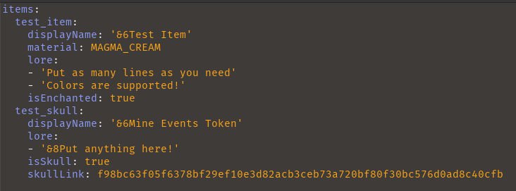

# Custom Items
Create custom items and skulls for your server! Each item can be customized to fit whatever you need. Special options for colors are provided using [ServerUtils](https://www.spigotmc.org/resources/serverutils.106515/).

**Requirements**
 - The only required dependency is [ServerUtils](https://www.spigotmc.org/resources/serverutils.106515/), which is a library plugin for all of my plugins.

**Overview:**
 - Any item inside any .yml in the plugins/CustomItems and all sub folders will be loaded. This allows you to easily organize all of your custom items.
 - Items can either be a Material from the vanilla game or any custom skull texture

**Commands** (/customitems or /citems)
 - All commands require the permission `customitems.admin`
 - /citems help - Opens the help menu
 - /citems give <player> <item-id> [amount] - Give a custom item to a player
 - /citems list - Opens a GUI with all items for convenience
 - /citems reload - Reloads the plugin and all custom items

**Configuration**
 - `stopPlacementMessage:` The message to send to players when they try to place a custom item. Nothing will send if the message is empty
 - `stopCustomItemCrafting:` Stops all items from being used in crafting recipes
 - `dropExtraItems:` If items given with `/citems give` should drop if the player has a full inventory

**Creating Items:**
 - To list any item, they must be inside the `items:` field in any .yml file 
 - The following image shows how to make both types of items

 - The initial item identifier, `test_item` and `test_skull` are set as a unique identifier to the item under `custom_item_id` in the item's NBT data
 - `displayName:` This is the name of the item
 - `material:` This is the material of the item. This can be omitted if the item is a skull
 - `lore:` A list of lines to add to the lore. Empty single quotes `''` can be used to create a blank line
 - `isEnchanted:` If set to true, the item will have an enchant glint applied to it. Glints do not show up on skulls, so it can be omitted for skulls
 - `isSkull:` If set to true, the item will look to the `skullLink` field for its skull link. If this field is omitted, the item will default it to false
 - `skullLink:` The link the item will parse to get the skull's texture. I use https://minecraft-heads.com/ and use the link from `Other -> Minecraft-URL`
 - `allowPlacement:` If true, this item can be placed
 - `uses:` The number of uses this item has (Used in the API, leave blank unless you know what you are doing)

**Final Notes:**
 - If an item looks wrong, then something likely went wrong internally. Check the console for a description of the error
 - Even in different files, items cannot have the same item id. This error will stop all duplicate occurrences from loading
 - Clicking items in the `/citems list` menu will put one in your inventory